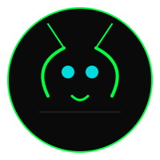

# Grasshopper IT Solutions - Landing Page



A modern, cyberpunk-inspired landing page for Grasshopper IT Solutions, showcasing premium software development services with a grassroots approach.

## 🚀 Features

### 🎨 Design & Experience
- **Cyberpunk Aesthetic**: Neon green and blue color scheme with glitch effects
- **Responsive Design**: Fully mobile-responsive with optimized touch interactions
- **Smooth Animations**: CSS animations and transitions throughout
- **Accessibility**: Semantic HTML and keyboard navigation support
- **Performance Optimized**: Fast loading with minimal dependencies

### 💼 Business Features
- **Service Showcase**: Comprehensive display of development capabilities
- **Tech Stack Visualization**: Animated marquee and detailed technology breakdown
- **Development Process**: 4-step pipeline visualization
- **App Center Integration**: Links to additional applications and tools
- **Contact Integration**: Direct email communication setup

### 🔧 Technical Highlights
- **Pure HTML/CSS/JS**: No frameworks required
- **Tailwind CSS**: Utility-first CSS framework for rapid styling
- **Lucide Icons**: Modern, consistent iconography
- **Google Fonts**: Professional typography with Space Mono and Inter
- **CSS Grid & Flexbox**: Modern layout techniques

## 🛠 Tech Stack

### Frontend Technologies
- **HTML5** - Semantic markup structure
- **CSS3** - Custom styles with Tailwind CSS framework
- **JavaScript (ES6+)** - Interactive functionality
- **Tailwind CSS** - Utility-first CSS framework

### Design & Assets
- **Lucide Icons** - Modern icon library
- **Google Fonts** - Space Mono, Inter, and Outfit fonts
- **SVG Logo** - Scalable vector graphics
- **CSS Animations** - Smooth transitions and effects

### Development Tools
- **Git** - Version control
- **GitHub Pages** - Static site hosting (ready for deployment)

## 📁 Project Structure

```
GrasshopperWebSite/
├── index.html              # Main landing page
├── README.md              # Project documentation
├── apps/                  # Application center directory
│   ├── index.html        # Apps landing page
│   ├── tiny-tales-teller-app/
│   │   ├── index.html    # Tiny Tales Teller app
│   │   └── privacy-policy.html
│   └── void-enigma-riddle-app/
│       ├── index.html    # Void Enigma Riddle app
│       └── privacy-policy.html
├── assets/               # Static assets
│   └── logo.svg         # Company logo
├── ads.txt              # Advertiser verification
├── app-ads.txt          # Mobile app ad verification
└── .gitignore          # Git ignore rules
```

## 🚀 Quick Start

### Local Development

1. **Clone the repository:**
   ```bash
   git clone https://github.com/grasshopperitsolutions/landing-page.git
   cd landing-page
   ```

2. **Open in browser:**
   Simply open `index.html` in any modern web browser.

3. **Local server (optional):**
   For local development with live reload:
   ```bash
   # Using Python 3
   python -m http.server 8000
   
   # Using Node.js
   npx serve
   
   # Using PHP
   php -S localhost:8000
   ```

### Building & Customization

The project uses Tailwind CSS for styling. To customize:

1. **Modify Tailwind config** in the `<script>` tag in `index.html`
2. **Update CSS** in the `<style>` section
3. **Edit content** directly in the HTML structure

## 📱 Browser Support

- Chrome (Latest)
- Firefox (Latest)
- Safari (Latest)
- Edge (Latest)
- Mobile browsers (iOS Safari, Chrome Mobile)

## 🎯 Key Sections

### 1. Hero Section
- Company branding with animated logo
- Tagline and value proposition
- Call-to-action buttons
- Floating AI agent (future feature)

### 2. Services Section
- 6 core service categories
- Detailed descriptions and capabilities
- Hover effects and animations

### 3. Tech Stack Section
- Comprehensive technology breakdown
- Categorized by frontend, backend, infrastructure, and specialized tools
- Modern and relevant technologies

### 4. Process Section
- 4-step development pipeline
- Visual step indicators
- Descriptive process explanations

### 5. App Center
- Links to additional applications
- Community-focused tools and utilities

### 6. Contact Section
- Professional contact information
- Email integration
- Visual network status indicator

## 🔧 Customization Guide

### Colors
Modify the color scheme in the Tailwind config:
```javascript
colors: {
  "grass-green": "#00ff41",
  "cyber-blue": "#00dbde", 
  "cyber-red": "#ff003c",
  "deep-space": "#0a0a0a",
  "code-gray": "#1e1e1e",
  "card-gray": "#151515",
}
```

### Content
Update text content directly in the HTML:
- Company information
- Service descriptions
- Contact details
- Navigation items

### Images
Replace assets in the `/assets` directory:
- Logo (`logo.svg`)
- Any additional images

## 🚀 Deployment

### GitHub Pages
1. Push to GitHub repository
2. Go to repository Settings > Pages
3. Select branch (usually `main` or `master`)
4. Your site will be live at `https://username.github.io/repository-name`

### Netlify
1. Connect GitHub repository
2. Set build command: (none needed for static site)
3. Set publish directory: `/` (root)
4. Deploy

### Vercel
1. Import project from GitHub
2. Configure as static site
3. Deploy

## 📄 License

This project is licensed under the MIT License - see the [LICENSE](LICENSE) file for details.

## 🤝 Contributing

1. Fork the project
2. Create your feature branch (`git checkout -b feature/AmazingFeature`)
3. Commit your changes (`git commit -m 'Add some AmazingFeature'`)
4. Push to the branch (`git push origin feature/AmazingFeature`)
5. Open a Pull Request

## 📞 Contact

- **Email**: grasshopper.it.solutions@gmail.com
- **GitHub**: [grasshopperitsolutions](https://github.com/grasshopperitsolutions)
- **Website**: [Coming Soon]

## 🆕 Future Features

- [ ] AI Chat Integration (Grassy Hopper)
- [ ] Dark/Light Theme Toggle
- [ ] Blog Section
- [ ] Client Testimonials
- [ ] Project Portfolio
- [ ] Team Members Section
- [ ] Newsletter Signup
- [ ] Contact Form

## 📊 Performance

- **Page Size**: ~50KB (optimized)
- **Load Time**: < 1 second (on fast connection)
- **Lighthouse Score**: 90+ (target)
- **Accessibility**: WCAG 2.1 AA compliant

---

**Made with ❤️ by Grasshopper IT Solutions**

[](https://opensource.org/licenses/MIT)
[](https://github.com/grasshopperitsolutions/landing-page/issues)
[](https://github.com/grasshopperitsolutions/landing-page/network/members)